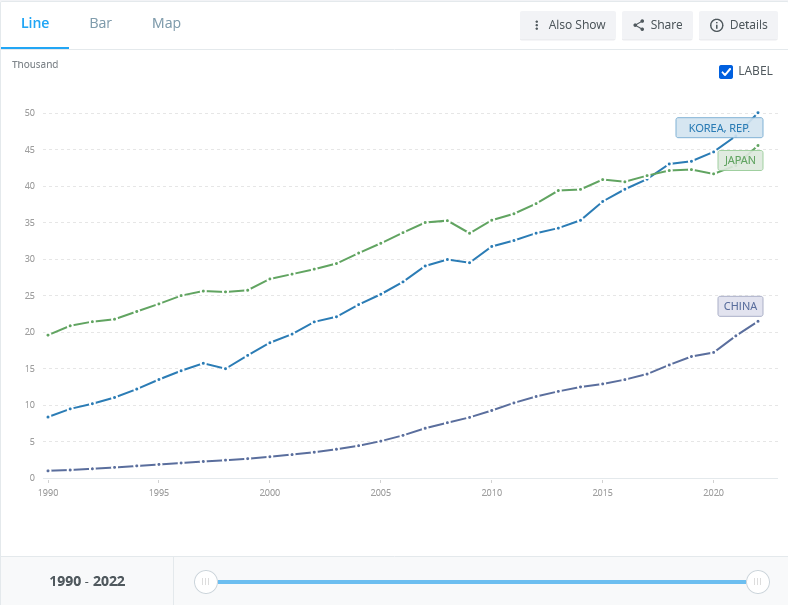
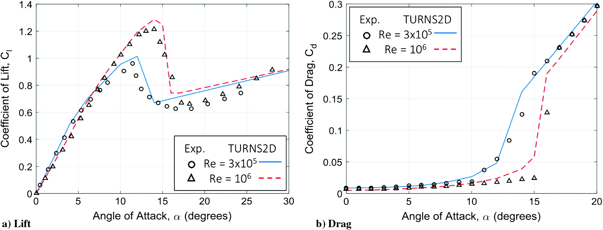

---

```{r setup, include=FALSE}
knitr::opts_chunk$set(echo = TRUE)
```

[Этот проект на GitHub](https://github.com/Nickitarius/R_study_project/tree/main).

Ниже приведены примеры научных статей с двумя примерами анализа:

1) описательный,
2) механистический.

## Описательный

### Оригинал

GDP per capita, PPP (current international $) - Korea, Rep., Japan, China.

Источник: https://data.worldbank.org/indicator/NY.GDP.PCAP.PP.CD?locations=KR-JP-CN.

На графике показано изменение со временем ВВП по ППС на душу населения трех крупнейших экономик Дальнего Востока с 1990-2022 гг (в текущих международных долларах). Исходные данные также можно скачать в виде электронных таблиц. Можно заметить, что в Японии этот показатель изначально был самым большим, причем с существенным отрывом. Однако, к 2022 году Южная Корея обогнала Японию, и в целом Корея показала наибольший рост.



### Обоснование выбора

Приведенный по ссылке материал не содержит в себе каких-либо причинно-следственных связей, зависимостей, логических построений, выводов. Это всего лишь "сырые" данные и их визуализация. Тем не менее, на приведенном выше графике уже можно заметить общие тенденции. В частности, разную скорость роста ВВП по ППС на душу населения, а также изменение соотношения этого показателя в разных странах. Этот анализ описывает тенденции, но не объясняет их.

Таким образом, можно считать этот анализ описательным.

## Ы
### Оригинальная работа

Basic Understanding of Airfoil Characteristics at Low Reynolds Numbers (10^4^ - 10^5^). 

Авторы: 
- Justin Winslow,
- Hikaru Otsuka,
- Bharath Govindarajan,
- Inderjit Chopra

DOI: https://doi.org/10.2514/1.C034415.

В данной работе описываются характеристики разных аэродинамических профилей при низких числах Рейнолдса (10^4^ - 10^5^). 

### Обоснование выбора

Статья является примером описательного анализа, так как в ней смоделировано поведение воздушных потоков вокруг нескольких аэродинамических профилей при разных значениях, из чего сделаны некоторые наблюдения. Точные функциональные зависимости не установлены, поэтому говорить о механистическом анализе не приходится. Однако авторы выявили некоторые тенденции, которые могут быть полезны при дальнейших аэродинамических исследованиях.

Сами авторы определяют свою цель следующим образом: 

>The goal of the present work was to use TURNS2D (a structured RANS solver with laminar-turbulent transition model) as a means to understand the low-Reynolds-number aerodynamics and, therefore, to provide guidelines for MAV and low-Reynolds-number designs.  

Заявленые цели авторов, таким образом, соответствуют описательному типу анализа, так как они состоят в *описании* методов моделирования. 

### Дополнительно

В статье приводятся (но не выводятся самими авторами) многочисленные формулы и иллюстрации, которые описывают модели, которые они рассматривают, а также полученные с их помощью научные результаты. Их примеры приведены ниже.

$$sig(x)= \frac{1}{1+e^{-x}}$$



## Механистический

### Оригинальная работа

Numerical Study on the Aerodynamic Characteristics of the NACA 0018 Airfoil at Low Reynolds Number for Darrieus Wind Turbines Using the Transition SST Model. 

Авторы:

DOI: https://doi.org/10.3390/pr9030477.

В этой работе выявляется зависимость характеристик лопасти пропеллера самолета при работе в режиме сваливания от соотношения её сторон, толщины профиля и числа Рейнольдса.   

### Обоснование выбора

Цель работы, заявленная авторами в её Summary, говорит сама за себя.

>To characterize the performance of a nonrotating blade in stall as a function
of its aspect ratio, airfoil thickness, and Reynolds number.

Выявление функциональной зависимости является задачей 